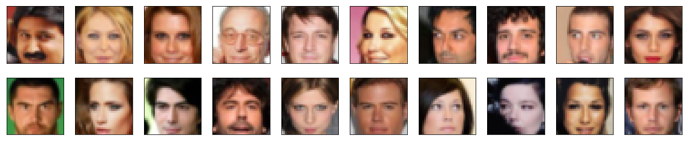
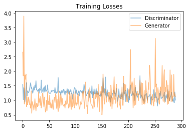
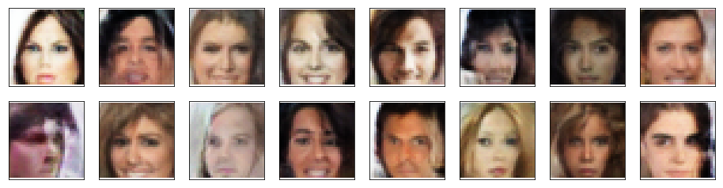

# Face Generation

In this project, you'll define and train a DCGAN on a dataset of faces. Your goal is to get a generator network to generate *new* images of faces that look as realistic as possible!

The project will be broken down into a series of tasks from **loading in data to defining and training adversarial networks**. At the end of the notebook, you'll be able to visualize the results of your trained Generator to see how it performs; your generated samples should look like fairly realistic faces with small amounts of noise.

### Get the Data

You'll be using the [CelebFaces Attributes Dataset (CelebA)](http://mmlab.ie.cuhk.edu.hk/projects/CelebA.html) to train your adversarial networks.

This dataset is more complex than the number datasets (like MNIST or SVHN) you've been working with, and so, you should prepare to define deeper networks and train them for a longer time to get good results. It is suggested that you utilize a GPU for training.

### Pre-processed Data

Since the project's main focus is on building the GANs, we've done *some* of the pre-processing for you. Each of the CelebA images has been cropped to remove parts of the image that don't include a face, then resized down to 64x64x3 NumPy images. Some sample data is show below.


> If you are working locally, you can download this data [by clicking here](https://s3.amazonaws.com/video.udacity-data.com/topher/2018/November/5be7eb6f_processed-celeba-small/processed-celeba-small.zip)

This is a zip file that you'll need to extract in the home directory of this notebook for further loading and processing. After extracting the data, you should be left with a directory of data `processed_celeba_small/`


```python
# can comment out after executing
# !unzip processed_celeba_small.zip
```


```python
data_dir = 'processed_celeba_small/'

"""
DON'T MODIFY ANYTHING IN THIS CELL
"""
import pickle as pkl
import matplotlib.pyplot as plt
import numpy as np
import problem_unittests as tests
#import helper

%matplotlib inline
```

## Visualize the CelebA Data

The [CelebA](http://mmlab.ie.cuhk.edu.hk/projects/CelebA.html) dataset contains over 200,000 celebrity images with annotations. Since you're going to be generating faces, you won't need the annotations, you'll only need the images. Note that these are color images with [3 color channels (RGB)](https://en.wikipedia.org/wiki/Channel_(digital_image)#RGB_Images) each.

### Pre-process and Load the Data

Since the project's main focus is on building the GANs, we've done *some* of the pre-processing for you. Each of the CelebA images has been cropped to remove parts of the image that don't include a face, then resized down to 64x64x3 NumPy images. This *pre-processed* dataset is a smaller subset of the very large CelebA data.

> There are a few other steps that you'll need to **transform** this data and create a **DataLoader**.

#### Exercise: Complete the following `get_dataloader` function, such that it satisfies these requirements:

* Your images should be square, Tensor images of size `image_size x image_size` in the x and y dimension.
* Your function should return a DataLoader that shuffles and batches these Tensor images.

#### ImageFolder

To create a dataset given a directory of images, it's recommended that you use PyTorch's [ImageFolder](https://pytorch.org/docs/stable/torchvision/datasets.html#imagefolder) wrapper, with a root directory `processed_celeba_small/` and data transformation passed in.


```python
# necessary imports
import torch
from torchvision import datasets
from torchvision import transforms
```


```python
def get_dataloader(batch_size, image_size, data_dir='processed_celeba_small/'):
    """
    Batch the neural network data using DataLoader
    :param batch_size: The size of each batch; the number of images in a batch
    :param img_size: The square size of the image data (x, y)
    :param data_dir: Directory where image data is located
    :return: DataLoader with batched data
    """
    # TODO: Implement function and return a dataloader
    
    transform = transforms.Compose([
        transforms.Resize(image_size),
        transforms.CenterCrop(image_size),
        transforms.ToTensor(),
    ])
    
    dataset = datasets.ImageFolder(data_dir, transform=transform)
    
    data_loader = torch.utils.data.DataLoader(dataset=dataset,
                                             batch_size=batch_size,
                                             shuffle=True)
    
    return data_loader

```

## Create a DataLoader

#### Exercise: Create a DataLoader `celeba_train_loader` with appropriate hyperparameters.

Call the above function and create a dataloader to view images. 
* You can decide on any reasonable `batch_size` parameter
* Your `image_size` **must be** `32`. Resizing the data to a smaller size will make for faster training, while still creating convincing images of faces!


```python
# Define function hyperparameters
batch_size = 64
img_size = 32

"""
DON'T MODIFY ANYTHING IN THIS CELL THAT IS BELOW THIS LINE
"""
# Call your function and get a dataloader
celeba_train_loader = get_dataloader(batch_size, img_size)

```

Next, you can view some images! You should seen square images of somewhat-centered faces.

Note: You'll need to convert the Tensor images into a NumPy type and transpose the dimensions to correctly display an image, suggested `imshow` code is below, but it may not be perfect.


```python
# helper display function
def imshow(img):
    npimg = img.numpy()
    plt.imshow(np.transpose(npimg, (1, 2, 0)))

"""
DON'T MODIFY ANYTHING IN THIS CELL THAT IS BELOW THIS LINE
"""
# obtain one batch of training images
dataiter = iter(celeba_train_loader)
images, _ = dataiter.next() # _ for no labels

# plot the images in the batch, along with the corresponding labels
fig = plt.figure(figsize=(20, 4))
plot_size=20
for idx in np.arange(plot_size):
    ax = fig.add_subplot(2, plot_size/2, idx+1, xticks=[], yticks=[])
    imshow(images[idx])
```





#### Exercise: Pre-process your image data and scale it to a pixel range of -1 to 1

You need to do a bit of pre-processing; you know that the output of a `tanh` activated generator will contain pixel values in a range from -1 to 1, and so, we need to rescale our training images to a range of -1 to 1. (Right now, they are in a range from 0-1.)


```python
# TODO: Complete the scale function
def scale(x, feature_range=(-1, 1)):
    ''' Scale takes in an image x and returns that image, scaled
       with a feature_range of pixel values from -1 to 1. 
       This function assumes that the input x is already scaled from 0-1.'''
    # assume x is scaled to (0, 1)
    # scale to feature_range and return scaled x
    min, max = feature_range
    x = x * (max - min) + min
    
    return x

```


```python
"""
DON'T MODIFY ANYTHING IN THIS CELL THAT IS BELOW THIS LINE
"""
# check scaled range
# should be close to -1 to 1
img = images[0]
scaled_img = scale(img)

print('Min: ', scaled_img.min())
print('Max: ', scaled_img.max())
```

    Min:  tensor(-0.9059)
    Max:  tensor(0.9451)


---
# Define the Model

A GAN is comprised of two adversarial networks, a discriminator and a generator.

## Discriminator

Your first task will be to define the discriminator. This is a convolutional classifier like you've built before, only without any maxpooling layers. To deal with this complex data, it's suggested you use a deep network with **normalization**. You are also allowed to create any helper functions that may be useful.

#### Exercise: Complete the Discriminator class
* The inputs to the discriminator are 32x32x3 tensor images
* The output should be a single value that will indicate whether a given image is real or fake


```python
import torch.nn as nn
import torch.nn.functional as F
```


```python
def conv(in_channels, out_channels, kernel_size, stride=2, padding=1, batch_norm=True):
    """
    Creates a convolutional layer, with optional batch normalization.
    """
    
    layers=[]
    conv_layer = nn.Conv2d(in_channels, out_channels,
                          kernel_size, stride, padding, bias=False)
    
    # append conv layer
    layers.append(conv_layer)
    
    if batch_norm:
        # append batchnorm layer
        layers.append(nn.BatchNorm2d(out_channels))
    
    # using Sequential container
    return nn.Sequential(*layers)
```


```python
class Discriminator(nn.Module):

    def __init__(self, conv_dim):
        """
        Initialize the Discriminator Module
        :param conv_dim: The depth of the first convolutional layer
        """
        super(Discriminator, self).__init__()

        # complete init function
        self.conv_dim = conv_dim
        
        self.conv1 = conv(3, conv_dim, 4, batch_norm=False) # First layer with batch normalization 
        self.conv2 = conv(conv_dim, conv_dim * 2, 4) 
        self.conv3 = conv(conv_dim * 2, conv_dim * 4, 4)
        
        self.fc = nn.Linear(conv_dim*4*4*4, 1)
        self.out = nn.Sigmoid()
        self.dropout = nn.Dropout(0.5)
        
        
        
    def forward(self, x):
        """
        Forward propagation of the neural network
        :param x: The input to the neural network     
        :return: Discriminator logits; the output of the neural network
        """
        x = F.leaky_relu(self.conv1(x), 0.2)
        x = F.leaky_relu(self.conv2(x), 0.2)
        x = F.leaky_relu(self.conv3(x), 0.2)
        
        x = x.view(-1, self.conv_dim*4*4*4)
        
        x = self.fc(x)
        x = self.dropout(x)
        
        # x = self.out(x)
        
        return x

"""
DON'T MODIFY ANYTHING IN THIS CELL THAT IS BELOW THIS LINE
"""
tests.test_discriminator(Discriminator)
```

    Tests Passed


## Generator

The generator should upsample an input and generate a *new* image of the same size as our training data `32x32x3`. This should be mostly transpose convolutional layers with normalization applied to the outputs.

#### Exercise: Complete the Generator class
* The inputs to the generator are vectors of some length `z_size`
* The output should be a image of shape `32x32x3`


```python
def deconv(in_channels, out_channels, kernel_size, stride=2, padding=1, batch_norm=True):
    
    layers=[]
    transpose_conv_layer = nn.ConvTranspose2d(in_channels, out_channels,
                                             kernel_size, stride, padding, bias=False)
    
    # append transpose convolutional layer
    layers.append(transpose_conv_layer)
    
    if batch_norm:
        # append batchnorm layer
        layers.append(nn.BatchNorm2d(out_channels))
    
    return nn.Sequential(*layers)
```


```python
class Generator(nn.Module):
    
    def __init__(self, z_size, conv_dim):
        """
        Initialize the Generator Module
        :param z_size: The length of the input latent vector, z
        :param conv_dim: The depth of the inputs to the *last* transpose convolutional layer
        """
        super(Generator, self).__init__()

        # complete init function
        self.conv_dim = conv_dim
        
        # first, fully-connected layer
        self.fc = nn.Linear(z_size, conv_dim*4*4*4)

        # transpose conv layers
        self.deconv1 = deconv(conv_dim*4, conv_dim*2, 4)
        self.deconv2 = deconv(conv_dim*2, conv_dim, 4)
        self.deconv3 = deconv(conv_dim, 3, 4, batch_norm=False)        
        self.dropout = nn.Dropout(0.5)
        
    def forward(self, x):
        """
        Forward propagation of the neural network
        :param x: The input to the neural network     
        :return: A 32x32x3 Tensor image as output
        """
        # define feedforward behavior
        
        x = self.fc(x)
        x = self.dropout(x)
        
        x = x.view(-1, self.conv_dim*4, 4, 4)
        
        x = F.relu(self.deconv1(x))
        x = F.relu(self.deconv2(x))
        x = F.tanh(self.deconv3(x))
        
        return x
"""
DON'T MODIFY ANYTHING IN THIS CELL THAT IS BELOW THIS LINE
"""
tests.test_generator(Generator)
```

    Tests Passed


## Initialize the weights of your networks

To help your models converge, you should initialize the weights of the convolutional and linear layers in your model. From reading the [original DCGAN paper](https://arxiv.org/pdf/1511.06434.pdf), they say:
> All weights were initialized from a zero-centered Normal distribution with standard deviation 0.02.

So, your next task will be to define a weight initialization function that does just this!

You can refer back to the lesson on weight initialization or even consult existing model code, such as that from [the `networks.py` file in CycleGAN Github repository](https://github.com/junyanz/pytorch-CycleGAN-and-pix2pix/blob/master/models/networks.py) to help you complete this function.

#### Exercise: Complete the weight initialization function

* This should initialize only **convolutional** and **linear** layers
* Initialize the weights to a normal distribution, centered around 0, with a standard deviation of 0.02.
* The bias terms, if they exist, may be left alone or set to 0.


```python
def weights_init_normal(m):
    """
    Applies initial weights to certain layers in a model .
    The weights are taken from a normal distribution 
    with mean = 0, std dev = 0.02.
    :param m: A module or layer in a network    
    """
    # classname will be something like:
    # `Conv`, `BatchNorm2d`, `Linear`, etc.
    classname = m.__class__.__name__
    
    # TODO: Apply initial weights to convolutional and linear layers
    
    if hasattr(m, 'weight') and (classname.find('Conv') != -1 or classname.find('Linear') != -1):
        m.weight.data.normal_(0.0, 0.02)

        # The bias terms, if they exist, set to 0
        if hasattr(m, 'bias') and m.bias is not None:
            m.bias.data.zero_()
    
```

## Build complete network

Define your models' hyperparameters and instantiate the discriminator and generator from the classes defined above. Make sure you've passed in the correct input arguments.


```python
"""
DON'T MODIFY ANYTHING IN THIS CELL THAT IS BELOW THIS LINE
"""
def build_network(d_conv_dim, g_conv_dim, z_size):
    # define discriminator and generator
    D = Discriminator(d_conv_dim)
    G = Generator(z_size=z_size, conv_dim=g_conv_dim)

    # initialize model weights
    D.apply(weights_init_normal)
    G.apply(weights_init_normal)

    print(D)
    print()
    print(G)
    
    return D, G

```

#### Exercise: Define model hyperparameters


```python
# Define model hyperparams
d_conv_dim = 64
g_conv_dim = 64
z_size = 100

"""
DON'T MODIFY ANYTHING IN THIS CELL THAT IS BELOW THIS LINE
"""
D, G = build_network(d_conv_dim, g_conv_dim, z_size)
```

    Discriminator(
      (conv1): Sequential(
        (0): Conv2d(3, 64, kernel_size=(4, 4), stride=(2, 2), padding=(1, 1), bias=False)
      )
      (conv2): Sequential(
        (0): Conv2d(64, 128, kernel_size=(4, 4), stride=(2, 2), padding=(1, 1), bias=False)
        (1): BatchNorm2d(128, eps=1e-05, momentum=0.1, affine=True, track_running_stats=True)
      )
      (conv3): Sequential(
        (0): Conv2d(128, 256, kernel_size=(4, 4), stride=(2, 2), padding=(1, 1), bias=False)
        (1): BatchNorm2d(256, eps=1e-05, momentum=0.1, affine=True, track_running_stats=True)
      )
      (fc): Linear(in_features=4096, out_features=1, bias=True)
      (out): Sigmoid()
      (dropout): Dropout(p=0.5)
    )
    
    Generator(
      (fc): Linear(in_features=100, out_features=4096, bias=True)
      (deconv1): Sequential(
        (0): ConvTranspose2d(256, 128, kernel_size=(4, 4), stride=(2, 2), padding=(1, 1), bias=False)
        (1): BatchNorm2d(128, eps=1e-05, momentum=0.1, affine=True, track_running_stats=True)
      )
      (deconv2): Sequential(
        (0): ConvTranspose2d(128, 64, kernel_size=(4, 4), stride=(2, 2), padding=(1, 1), bias=False)
        (1): BatchNorm2d(64, eps=1e-05, momentum=0.1, affine=True, track_running_stats=True)
      )
      (deconv3): Sequential(
        (0): ConvTranspose2d(64, 3, kernel_size=(4, 4), stride=(2, 2), padding=(1, 1), bias=False)
      )
      (dropout): Dropout(p=0.5)
    )


### Training on GPU

Check if you can train on GPU. Here, we'll set this as a boolean variable `train_on_gpu`. Later, you'll be responsible for making sure that 
>* Models,
* Model inputs, and
* Loss function arguments

Are moved to GPU, where appropriate.


```python
"""
DON'T MODIFY ANYTHING IN THIS CELL
"""
import torch

# Check for a GPU
train_on_gpu = torch.cuda.is_available()
if not train_on_gpu:
    print('No GPU found. Please use a GPU to train your neural network.')
else:
    print('Training on GPU!')
```

    Training on GPU!


---
## Discriminator and Generator Losses

Now we need to calculate the losses for both types of adversarial networks.

### Discriminator Losses

> * For the discriminator, the total loss is the sum of the losses for real and fake images, `d_loss = d_real_loss + d_fake_loss`. 
* Remember that we want the discriminator to output 1 for real images and 0 for fake images, so we need to set up the losses to reflect that.


### Generator Loss

The generator loss will look similar only with flipped labels. The generator's goal is to get the discriminator to *think* its generated images are *real*.

#### Exercise: Complete real and fake loss functions

**You may choose to use either cross entropy or a least squares error loss to complete the following `real_loss` and `fake_loss` functions.**


```python
def real_loss(D_out):
    '''Calculates how close discriminator outputs are to being real.
       param, D_out: discriminator logits
       return: real loss'''
    batch_size = D_out.size(0)
    # label smoothing
    labels = torch.ones(batch_size) * np.random.uniform(0.7, 1.2)
    if train_on_gpu:
        labels = labels.cuda()
    criterion = nn.BCEWithLogitsLoss()
    loss = criterion(D_out.squeeze(), labels)
    return loss

def fake_loss(D_out):
    '''Calculates how close discriminator outputs are to being fake.
       param, D_out: discriminator logits
       return: fake loss'''
    batch_size = D_out.size(0)
    labels = torch.zeros(batch_size) * np.random.uniform(0.0, 0.3) # fake labels = 0.3
    if train_on_gpu:
        labels = labels.cuda()
    criterion = nn.BCEWithLogitsLoss()
    loss = criterion(D_out.squeeze(), labels)
    return loss
```

## Optimizers

#### Exercise: Define optimizers for your Discriminator (D) and Generator (G)

Define optimizers for your models with appropriate hyperparameters.


```python
import torch.optim as optim

# params
lr = 0.0005
beta1= 0.1
beta2= 0.99

# Create optimizers for the discriminator D and generator G
d_optimizer = optim.Adam(D.parameters(), lr, [beta1, beta2])
g_optimizer = optim.Adam(G.parameters(), lr, [beta1, beta2])
```

---
## Training

Training will involve alternating between training the discriminator and the generator. You'll use your functions `real_loss` and `fake_loss` to help you calculate the discriminator losses.

* You should train the discriminator by alternating on real and fake images
* Then the generator, which tries to trick the discriminator and should have an opposing loss function


#### Saving Samples

You've been given some code to print out some loss statistics and save some generated "fake" samples.

#### Exercise: Complete the training function

Keep in mind that, if you've moved your models to GPU, you'll also have to move any model inputs to GPU.


```python
def train(D, G, n_epochs, print_every=50):
    '''Trains adversarial networks for some number of epochs
       param, D: the discriminator network
       param, G: the generator network
       param, n_epochs: number of epochs to train for
       param, print_every: when to print and record the models' losses
       return: D and G losses'''
    
    # move models to GPU
    if train_on_gpu:
        D.cuda()
        G.cuda()

    # keep track of loss and generated, "fake" samples
    samples = []
    losses = []

    # Get some fixed data for sampling. These are images that are held
    # constant throughout training, and allow us to inspect the model's performance
    sample_size=16
    fixed_z = np.random.uniform(-1, 1, size=(sample_size, z_size))
    fixed_z = torch.from_numpy(fixed_z).float()
    # move z to GPU if available
    if train_on_gpu:
        fixed_z = fixed_z.cuda()

    # epoch training loop
    for epoch in range(n_epochs):

        # batch training loop
        for batch_i, (real_images, _) in enumerate(celeba_train_loader):

            batch_size = real_images.size(0)
            real_images = scale(real_images)

            # ===============================================
            #         YOUR CODE HERE: TRAIN THE NETWORKS
            # ===============================================
            
            # 1. Train the discriminator on real and fake images
            
            d_optimizer.zero_grad()
            
            if train_on_gpu:
                real_images = real_images.cuda()
            
            d_out = D(real_images)
            d_real_loss = real_loss(d_out)
            
            # Generate fake images
            z = np.random.uniform(-1, 1, size=(batch_size, z_size))
            z = torch.from_numpy(z).float()
            
            if train_on_gpu:
                z = z.cuda()
                
            fake_images = G(z)
            
            d_fake_out = D(fake_images)
            d_fake_loss = fake_loss(d_fake_out)

            # add up loss and perform backprop
            d_loss = d_real_loss + d_fake_loss
            
            d_loss.backward()
            d_optimizer.step()

            # 2. Train the generator with an adversarial loss            
            g_optimizer.zero_grad()
            
            # Generate fake images
            z = np.random.uniform(-1, 1, size=(batch_size, z_size))
            z = torch.from_numpy(z).float()
            
            if train_on_gpu:
                z = z.cuda()
                
            fake_images = G(z)
            # D.eval()
            # Compute the discriminator losses on fake images 
            # using flipped labels!
            g_fake_out = D(fake_images)
            g_loss = real_loss(g_fake_out) # use real loss to flip labels
            # g_loss = torch.mean(g_fake_out**2)
            # D.train()
            # perform backprop
            g_loss.backward()
            g_optimizer.step()            
            
            
            # ===============================================
            #              END OF YOUR CODE
            # ===============================================

            # Print some loss stats
            if batch_i % print_every == 0:
                # append discriminator loss and generator loss
                losses.append((d_loss.item(), g_loss.item()))
                # print discriminator and generator loss
                print('Epoch [{:5d}/{:5d}] | d_loss: {:6.4f} | g_loss: {:6.4f}'.format(
                        epoch+1, n_epochs, d_loss.item(), g_loss.item()))


        ## AFTER EACH EPOCH##    
        # this code assumes your generator is named G, feel free to change the name
        # generate and save sample, fake images
        G.eval() # for generating samples
        samples_z = G(fixed_z)
        samples.append(samples_z)
        G.train() # back to training mode

    # Save training generator samples
    with open('train_samples.pkl', 'wb') as f:
        pkl.dump(samples, f)
    
    # finally return losses
    return losses
```

Set your number of training epochs and train your GAN!


```python
# set number of epochs 
n_epochs = 10


"""
DON'T MODIFY ANYTHING IN THIS CELL
"""
# call training function
losses = train(D, G, n_epochs=n_epochs)
```

    Epoch [    1/   10] | d_loss: 1.5408 | g_loss: 2.6520
    Epoch [    1/   10] | d_loss: 1.0184 | g_loss: 1.8386
    Epoch [    1/   10] | d_loss: 1.4313 | g_loss: 3.8901
    Epoch [    1/   10] | d_loss: 1.3065 | g_loss: 0.8713
    Epoch [    1/   10] | d_loss: 0.9330 | g_loss: 1.8646
    Epoch [    1/   10] | d_loss: 1.1019 | g_loss: 1.7223
    Epoch [    1/   10] | d_loss: 1.4205 | g_loss: 1.8999
    Epoch [    1/   10] | d_loss: 1.6052 | g_loss: 0.7808
    Epoch [    1/   10] | d_loss: 1.1539 | g_loss: 1.1222
    Epoch [    1/   10] | d_loss: 1.3200 | g_loss: 0.8409
    Epoch [    1/   10] | d_loss: 1.2893 | g_loss: 0.9370
    Epoch [    1/   10] | d_loss: 1.2589 | g_loss: 1.1049
    Epoch [    1/   10] | d_loss: 1.3121 | g_loss: 0.9891
    Epoch [    1/   10] | d_loss: 1.3976 | g_loss: 0.8492
    Epoch [    1/   10] | d_loss: 1.5089 | g_loss: 0.8724
    Epoch [    1/   10] | d_loss: 1.5993 | g_loss: 0.7284
    Epoch [    1/   10] | d_loss: 1.4006 | g_loss: 1.3172
    Epoch [    1/   10] | d_loss: 1.4443 | g_loss: 0.5557
    Epoch [    1/   10] | d_loss: 1.3066 | g_loss: 0.9515
    Epoch [    1/   10] | d_loss: 1.2398 | g_loss: 0.8665
    Epoch [    1/   10] | d_loss: 1.3599 | g_loss: 0.8247
    Epoch [    1/   10] | d_loss: 1.4661 | g_loss: 0.6645
    Epoch [    1/   10] | d_loss: 1.3551 | g_loss: 0.8120
    Epoch [    1/   10] | d_loss: 1.5200 | g_loss: 1.0522
    Epoch [    1/   10] | d_loss: 1.4373 | g_loss: 0.7942
    Epoch [    1/   10] | d_loss: 1.6691 | g_loss: 0.6333
    Epoch [    1/   10] | d_loss: 1.3577 | g_loss: 0.8883
    Epoch [    1/   10] | d_loss: 1.3562 | g_loss: 0.8911
    Epoch [    1/   10] | d_loss: 1.3109 | g_loss: 0.7773
    Epoch [    2/   10] | d_loss: 1.3154 | g_loss: 0.8111
    Epoch [    2/   10] | d_loss: 1.3771 | g_loss: 1.2884
    Epoch [    2/   10] | d_loss: 1.2412 | g_loss: 0.9291
    Epoch [    2/   10] | d_loss: 1.4031 | g_loss: 1.0519
    Epoch [    2/   10] | d_loss: 1.3430 | g_loss: 0.8232
    Epoch [    2/   10] | d_loss: 1.3597 | g_loss: 1.1321
    Epoch [    2/   10] | d_loss: 1.6903 | g_loss: 0.7376
    Epoch [    2/   10] | d_loss: 1.2588 | g_loss: 0.8631
    Epoch [    2/   10] | d_loss: 1.3187 | g_loss: 1.2070
    Epoch [    2/   10] | d_loss: 1.3831 | g_loss: 1.2459
    Epoch [    2/   10] | d_loss: 1.4251 | g_loss: 0.9579
    Epoch [    2/   10] | d_loss: 1.2683 | g_loss: 0.7708
    Epoch [    2/   10] | d_loss: 1.4610 | g_loss: 1.1059
    Epoch [    2/   10] | d_loss: 1.2856 | g_loss: 0.7818
    Epoch [    2/   10] | d_loss: 1.5001 | g_loss: 0.5976
    Epoch [    2/   10] | d_loss: 1.3062 | g_loss: 0.6339
    Epoch [    2/   10] | d_loss: 1.3414 | g_loss: 0.9954
    Epoch [    2/   10] | d_loss: 1.3460 | g_loss: 0.6490
    Epoch [    2/   10] | d_loss: 1.5266 | g_loss: 1.2898
    Epoch [    2/   10] | d_loss: 1.2930 | g_loss: 0.8526
    Epoch [    2/   10] | d_loss: 1.2832 | g_loss: 0.9674
    Epoch [    2/   10] | d_loss: 1.2355 | g_loss: 0.8455
    Epoch [    2/   10] | d_loss: 1.2481 | g_loss: 1.1729
    Epoch [    2/   10] | d_loss: 1.2365 | g_loss: 0.7515
    Epoch [    2/   10] | d_loss: 1.2476 | g_loss: 0.9137
    Epoch [    2/   10] | d_loss: 1.3335 | g_loss: 0.8390
    Epoch [    2/   10] | d_loss: 1.2908 | g_loss: 0.7280
    Epoch [    2/   10] | d_loss: 1.3290 | g_loss: 1.0083
    Epoch [    2/   10] | d_loss: 1.3190 | g_loss: 0.7261
    Epoch [    3/   10] | d_loss: 1.3342 | g_loss: 0.6878
    Epoch [    3/   10] | d_loss: 1.3228 | g_loss: 1.0144
    Epoch [    3/   10] | d_loss: 1.2632 | g_loss: 1.1000
    Epoch [    3/   10] | d_loss: 1.4369 | g_loss: 0.9195
    Epoch [    3/   10] | d_loss: 1.2657 | g_loss: 1.2250
    Epoch [    3/   10] | d_loss: 1.2913 | g_loss: 1.1598
    Epoch [    3/   10] | d_loss: 1.2387 | g_loss: 0.7213
    Epoch [    3/   10] | d_loss: 1.2917 | g_loss: 1.0366
    Epoch [    3/   10] | d_loss: 1.2704 | g_loss: 0.7876
    Epoch [    3/   10] | d_loss: 1.7794 | g_loss: 0.6125
    Epoch [    3/   10] | d_loss: 1.3280 | g_loss: 1.3234
    Epoch [    3/   10] | d_loss: 1.2600 | g_loss: 0.9825
    Epoch [    3/   10] | d_loss: 1.3160 | g_loss: 0.7314
    Epoch [    3/   10] | d_loss: 1.2756 | g_loss: 0.9573
    Epoch [    3/   10] | d_loss: 1.1709 | g_loss: 1.2142
    Epoch [    3/   10] | d_loss: 1.3311 | g_loss: 1.0725
    Epoch [    3/   10] | d_loss: 1.2571 | g_loss: 0.8325
    Epoch [    3/   10] | d_loss: 1.3238 | g_loss: 1.0568
    Epoch [    3/   10] | d_loss: 1.2455 | g_loss: 0.8382
    Epoch [    3/   10] | d_loss: 1.3730 | g_loss: 0.8299
    Epoch [    3/   10] | d_loss: 1.3651 | g_loss: 0.7907
    Epoch [    3/   10] | d_loss: 1.2602 | g_loss: 0.8642
    Epoch [    3/   10] | d_loss: 1.1798 | g_loss: 0.7295
    Epoch [    3/   10] | d_loss: 1.3102 | g_loss: 0.9746
    Epoch [    3/   10] | d_loss: 1.2821 | g_loss: 0.8591
    Epoch [    3/   10] | d_loss: 1.2659 | g_loss: 0.8778
    Epoch [    3/   10] | d_loss: 1.3972 | g_loss: 1.3291
    Epoch [    3/   10] | d_loss: 1.2920 | g_loss: 0.8920
    Epoch [    3/   10] | d_loss: 1.2266 | g_loss: 0.8740
    Epoch [    4/   10] | d_loss: 1.3712 | g_loss: 0.7294
    Epoch [    4/   10] | d_loss: 1.1967 | g_loss: 0.7782
    Epoch [    4/   10] | d_loss: 1.3220 | g_loss: 1.2724
    Epoch [    4/   10] | d_loss: 1.2981 | g_loss: 1.1189
    Epoch [    4/   10] | d_loss: 1.3737 | g_loss: 0.7992
    Epoch [    4/   10] | d_loss: 1.2309 | g_loss: 0.6900
    Epoch [    4/   10] | d_loss: 1.2378 | g_loss: 1.2410
    Epoch [    4/   10] | d_loss: 1.0403 | g_loss: 0.7704
    Epoch [    4/   10] | d_loss: 1.2152 | g_loss: 0.8085
    Epoch [    4/   10] | d_loss: 1.2453 | g_loss: 1.2058
    Epoch [    4/   10] | d_loss: 1.3633 | g_loss: 0.8106
    Epoch [    4/   10] | d_loss: 1.4354 | g_loss: 0.7386
    Epoch [    4/   10] | d_loss: 1.4169 | g_loss: 1.3119
    Epoch [    4/   10] | d_loss: 1.2427 | g_loss: 0.8919
    Epoch [    4/   10] | d_loss: 1.2349 | g_loss: 0.8121
    Epoch [    4/   10] | d_loss: 1.3524 | g_loss: 0.9106
    Epoch [    4/   10] | d_loss: 1.1889 | g_loss: 0.8651
    Epoch [    4/   10] | d_loss: 1.2316 | g_loss: 1.1531
    Epoch [    4/   10] | d_loss: 1.2615 | g_loss: 1.2178
    Epoch [    4/   10] | d_loss: 1.3205 | g_loss: 0.8680
    Epoch [    4/   10] | d_loss: 1.1501 | g_loss: 0.7142
    Epoch [    4/   10] | d_loss: 1.3051 | g_loss: 0.6936
    Epoch [    4/   10] | d_loss: 1.3397 | g_loss: 0.9445
    Epoch [    4/   10] | d_loss: 1.2935 | g_loss: 0.8515
    Epoch [    4/   10] | d_loss: 1.3129 | g_loss: 0.8740
    Epoch [    4/   10] | d_loss: 1.2490 | g_loss: 0.9326
    Epoch [    4/   10] | d_loss: 1.3263 | g_loss: 1.2786
    Epoch [    4/   10] | d_loss: 1.2264 | g_loss: 1.2954
    Epoch [    4/   10] | d_loss: 1.2938 | g_loss: 1.3089
    Epoch [    5/   10] | d_loss: 1.5483 | g_loss: 0.9417
    Epoch [    5/   10] | d_loss: 1.4416 | g_loss: 0.7180
    Epoch [    5/   10] | d_loss: 1.2578 | g_loss: 1.0833
    Epoch [    5/   10] | d_loss: 1.2971 | g_loss: 1.6242
    Epoch [    5/   10] | d_loss: 1.1567 | g_loss: 0.7872
    Epoch [    5/   10] | d_loss: 1.1577 | g_loss: 0.8074
    Epoch [    5/   10] | d_loss: 1.2567 | g_loss: 0.8194
    Epoch [    5/   10] | d_loss: 1.2265 | g_loss: 0.5402
    Epoch [    5/   10] | d_loss: 1.3658 | g_loss: 1.3053
    Epoch [    5/   10] | d_loss: 1.2746 | g_loss: 0.9627
    Epoch [    5/   10] | d_loss: 1.0929 | g_loss: 1.1510
    Epoch [    5/   10] | d_loss: 1.2270 | g_loss: 1.4307
    Epoch [    5/   10] | d_loss: 1.3047 | g_loss: 1.0268
    Epoch [    5/   10] | d_loss: 1.2511 | g_loss: 0.8877
    Epoch [    5/   10] | d_loss: 1.2165 | g_loss: 0.8276
    Epoch [    5/   10] | d_loss: 1.4978 | g_loss: 0.8348
    Epoch [    5/   10] | d_loss: 1.0857 | g_loss: 0.7715
    Epoch [    5/   10] | d_loss: 1.2985 | g_loss: 0.7019
    Epoch [    5/   10] | d_loss: 1.1762 | g_loss: 1.2851
    Epoch [    5/   10] | d_loss: 1.3905 | g_loss: 0.8558
    Epoch [    5/   10] | d_loss: 1.2214 | g_loss: 0.7696
    Epoch [    5/   10] | d_loss: 1.2379 | g_loss: 1.2293
    Epoch [    5/   10] | d_loss: 1.2325 | g_loss: 1.0533
    Epoch [    5/   10] | d_loss: 1.4027 | g_loss: 1.3160
    Epoch [    5/   10] | d_loss: 1.2098 | g_loss: 1.1031
    Epoch [    5/   10] | d_loss: 1.3124 | g_loss: 1.2480
    Epoch [    5/   10] | d_loss: 1.1999 | g_loss: 0.7620
    Epoch [    5/   10] | d_loss: 1.2581 | g_loss: 1.1254
    Epoch [    5/   10] | d_loss: 1.1911 | g_loss: 1.5464
    Epoch [    6/   10] | d_loss: 1.1698 | g_loss: 0.6050
    Epoch [    6/   10] | d_loss: 1.1482 | g_loss: 1.0672
    Epoch [    6/   10] | d_loss: 1.2195 | g_loss: 1.2944
    Epoch [    6/   10] | d_loss: 1.1230 | g_loss: 1.2385
    Epoch [    6/   10] | d_loss: 1.1752 | g_loss: 1.4692
    Epoch [    6/   10] | d_loss: 1.3123 | g_loss: 0.4943
    Epoch [    6/   10] | d_loss: 1.2690 | g_loss: 0.7977
    Epoch [    6/   10] | d_loss: 1.7709 | g_loss: 1.9018
    Epoch [    6/   10] | d_loss: 1.3126 | g_loss: 1.3819
    Epoch [    6/   10] | d_loss: 1.2445 | g_loss: 0.9922
    Epoch [    6/   10] | d_loss: 1.3971 | g_loss: 0.8717
    Epoch [    6/   10] | d_loss: 1.1689 | g_loss: 1.3629
    Epoch [    6/   10] | d_loss: 1.7965 | g_loss: 1.3733
    Epoch [    6/   10] | d_loss: 1.0938 | g_loss: 0.9331
    Epoch [    6/   10] | d_loss: 1.2204 | g_loss: 1.0898
    Epoch [    6/   10] | d_loss: 1.3579 | g_loss: 1.2234
    Epoch [    6/   10] | d_loss: 1.1390 | g_loss: 1.2353
    Epoch [    6/   10] | d_loss: 1.1488 | g_loss: 1.2721
    Epoch [    6/   10] | d_loss: 1.1529 | g_loss: 0.9528
    Epoch [    6/   10] | d_loss: 1.0893 | g_loss: 1.2706
    Epoch [    6/   10] | d_loss: 1.0321 | g_loss: 0.9556
    Epoch [    6/   10] | d_loss: 0.9356 | g_loss: 0.7981
    Epoch [    6/   10] | d_loss: 1.1664 | g_loss: 1.5217
    Epoch [    6/   10] | d_loss: 1.0801 | g_loss: 1.2478
    Epoch [    6/   10] | d_loss: 1.1383 | g_loss: 0.6993
    Epoch [    6/   10] | d_loss: 1.2420 | g_loss: 1.0860
    Epoch [    6/   10] | d_loss: 1.2301 | g_loss: 0.8670
    Epoch [    6/   10] | d_loss: 1.3471 | g_loss: 1.3514
    Epoch [    6/   10] | d_loss: 1.3290 | g_loss: 1.8099
    Epoch [    7/   10] | d_loss: 1.2230 | g_loss: 1.0304
    Epoch [    7/   10] | d_loss: 1.2469 | g_loss: 1.0774
    Epoch [    7/   10] | d_loss: 1.1348 | g_loss: 0.8953
    Epoch [    7/   10] | d_loss: 1.3327 | g_loss: 1.5531
    Epoch [    7/   10] | d_loss: 1.4056 | g_loss: 1.3763
    Epoch [    7/   10] | d_loss: 0.9597 | g_loss: 0.7603
    Epoch [    7/   10] | d_loss: 1.0795 | g_loss: 0.8963
    Epoch [    7/   10] | d_loss: 1.1221 | g_loss: 1.1747
    Epoch [    7/   10] | d_loss: 1.3903 | g_loss: 1.1707
    Epoch [    7/   10] | d_loss: 1.1074 | g_loss: 0.8434
    Epoch [    7/   10] | d_loss: 1.0942 | g_loss: 0.8327
    Epoch [    7/   10] | d_loss: 1.0502 | g_loss: 0.6991
    Epoch [    7/   10] | d_loss: 1.2220 | g_loss: 1.1892
    Epoch [    7/   10] | d_loss: 1.1162 | g_loss: 1.0480
    Epoch [    7/   10] | d_loss: 1.2766 | g_loss: 1.4605
    Epoch [    7/   10] | d_loss: 1.1358 | g_loss: 0.8346
    Epoch [    7/   10] | d_loss: 1.0132 | g_loss: 0.8236
    Epoch [    7/   10] | d_loss: 1.5852 | g_loss: 1.8219
    Epoch [    7/   10] | d_loss: 1.2135 | g_loss: 1.1655
    Epoch [    7/   10] | d_loss: 1.2447 | g_loss: 1.5476
    Epoch [    7/   10] | d_loss: 1.3513 | g_loss: 1.3238
    Epoch [    7/   10] | d_loss: 0.9537 | g_loss: 1.5315
    Epoch [    7/   10] | d_loss: 1.1241 | g_loss: 0.9489
    Epoch [    7/   10] | d_loss: 1.1814 | g_loss: 1.2158
    Epoch [    7/   10] | d_loss: 1.4052 | g_loss: 0.9524
    Epoch [    7/   10] | d_loss: 1.1017 | g_loss: 0.9839
    Epoch [    7/   10] | d_loss: 0.9209 | g_loss: 1.2875
    Epoch [    7/   10] | d_loss: 1.1451 | g_loss: 1.3682
    Epoch [    7/   10] | d_loss: 1.0105 | g_loss: 1.0734
    Epoch [    8/   10] | d_loss: 1.3616 | g_loss: 1.5273
    Epoch [    8/   10] | d_loss: 1.5219 | g_loss: 2.7400
    Epoch [    8/   10] | d_loss: 1.2448 | g_loss: 1.2319
    Epoch [    8/   10] | d_loss: 1.1596 | g_loss: 1.5121
    Epoch [    8/   10] | d_loss: 1.1808 | g_loss: 1.6415
    Epoch [    8/   10] | d_loss: 1.2946 | g_loss: 1.5500
    Epoch [    8/   10] | d_loss: 1.1625 | g_loss: 0.7355
    Epoch [    8/   10] | d_loss: 1.2299 | g_loss: 1.1289
    Epoch [    8/   10] | d_loss: 1.1769 | g_loss: 1.7593
    Epoch [    8/   10] | d_loss: 0.9933 | g_loss: 0.8244
    Epoch [    8/   10] | d_loss: 1.4470 | g_loss: 1.5092
    Epoch [    8/   10] | d_loss: 1.2780 | g_loss: 0.8508
    Epoch [    8/   10] | d_loss: 1.2944 | g_loss: 1.2312
    Epoch [    8/   10] | d_loss: 1.1629 | g_loss: 1.1829
    Epoch [    8/   10] | d_loss: 1.0983 | g_loss: 1.1904
    Epoch [    8/   10] | d_loss: 1.1563 | g_loss: 1.3124
    Epoch [    8/   10] | d_loss: 1.2168 | g_loss: 0.9854
    Epoch [    8/   10] | d_loss: 1.1981 | g_loss: 1.2279
    Epoch [    8/   10] | d_loss: 1.2063 | g_loss: 1.2827
    Epoch [    8/   10] | d_loss: 1.8431 | g_loss: 1.6896
    Epoch [    8/   10] | d_loss: 1.0766 | g_loss: 1.4142
    Epoch [    8/   10] | d_loss: 1.1012 | g_loss: 1.1290
    Epoch [    8/   10] | d_loss: 1.1754 | g_loss: 1.5977
    Epoch [    8/   10] | d_loss: 1.1284 | g_loss: 0.8450
    Epoch [    8/   10] | d_loss: 1.1010 | g_loss: 1.5790
    Epoch [    8/   10] | d_loss: 0.9896 | g_loss: 0.9093
    Epoch [    8/   10] | d_loss: 1.0424 | g_loss: 0.8796
    Epoch [    8/   10] | d_loss: 0.9175 | g_loss: 1.3397
    Epoch [    8/   10] | d_loss: 1.1826 | g_loss: 0.8704
    Epoch [    9/   10] | d_loss: 1.1702 | g_loss: 0.9659
    Epoch [    9/   10] | d_loss: 1.1928 | g_loss: 1.6729
    Epoch [    9/   10] | d_loss: 1.2342 | g_loss: 1.3306
    Epoch [    9/   10] | d_loss: 1.1026 | g_loss: 1.2516
    Epoch [    9/   10] | d_loss: 0.9983 | g_loss: 0.9073
    Epoch [    9/   10] | d_loss: 1.1309 | g_loss: 1.1350
    Epoch [    9/   10] | d_loss: 1.1366 | g_loss: 1.6069
    Epoch [    9/   10] | d_loss: 1.1395 | g_loss: 1.3679
    Epoch [    9/   10] | d_loss: 1.1495 | g_loss: 2.1969
    Epoch [    9/   10] | d_loss: 1.1980 | g_loss: 2.0242
    Epoch [    9/   10] | d_loss: 0.8685 | g_loss: 1.2855
    Epoch [    9/   10] | d_loss: 1.1156 | g_loss: 1.0872
    Epoch [    9/   10] | d_loss: 1.1197 | g_loss: 0.8378
    Epoch [    9/   10] | d_loss: 1.0135 | g_loss: 1.1472
    Epoch [    9/   10] | d_loss: 1.0143 | g_loss: 1.1973
    Epoch [    9/   10] | d_loss: 1.0338 | g_loss: 0.9054
    Epoch [    9/   10] | d_loss: 1.3642 | g_loss: 0.8060
    Epoch [    9/   10] | d_loss: 1.2023 | g_loss: 1.1022
    Epoch [    9/   10] | d_loss: 1.0889 | g_loss: 0.9611
    Epoch [    9/   10] | d_loss: 1.2666 | g_loss: 3.1245
    Epoch [    9/   10] | d_loss: 1.0810 | g_loss: 1.4555
    Epoch [    9/   10] | d_loss: 1.0897 | g_loss: 1.5582
    Epoch [    9/   10] | d_loss: 1.1183 | g_loss: 0.9321
    Epoch [    9/   10] | d_loss: 0.8029 | g_loss: 1.2892
    Epoch [    9/   10] | d_loss: 1.0545 | g_loss: 1.4366
    Epoch [    9/   10] | d_loss: 1.0266 | g_loss: 1.2634
    Epoch [    9/   10] | d_loss: 1.0701 | g_loss: 0.8977
    Epoch [    9/   10] | d_loss: 1.2388 | g_loss: 0.8667
    Epoch [    9/   10] | d_loss: 1.1716 | g_loss: 1.3456
    Epoch [   10/   10] | d_loss: 1.3018 | g_loss: 1.4553
    Epoch [   10/   10] | d_loss: 1.0583 | g_loss: 1.1311
    Epoch [   10/   10] | d_loss: 1.0751 | g_loss: 1.4515
    Epoch [   10/   10] | d_loss: 1.0978 | g_loss: 2.1963
    Epoch [   10/   10] | d_loss: 1.0989 | g_loss: 1.2012
    Epoch [   10/   10] | d_loss: 1.1458 | g_loss: 0.9589
    Epoch [   10/   10] | d_loss: 1.1465 | g_loss: 1.7987
    Epoch [   10/   10] | d_loss: 1.2717 | g_loss: 2.0485
    Epoch [   10/   10] | d_loss: 0.9656 | g_loss: 0.9238
    Epoch [   10/   10] | d_loss: 0.9524 | g_loss: 1.4412
    Epoch [   10/   10] | d_loss: 1.1515 | g_loss: 1.3004
    Epoch [   10/   10] | d_loss: 1.0757 | g_loss: 1.6770
    Epoch [   10/   10] | d_loss: 1.1965 | g_loss: 1.5831
    Epoch [   10/   10] | d_loss: 1.0542 | g_loss: 0.8580
    Epoch [   10/   10] | d_loss: 1.3617 | g_loss: 1.5193
    Epoch [   10/   10] | d_loss: 1.1287 | g_loss: 0.8810
    Epoch [   10/   10] | d_loss: 1.0855 | g_loss: 1.3148
    Epoch [   10/   10] | d_loss: 0.9772 | g_loss: 0.9774
    Epoch [   10/   10] | d_loss: 1.0978 | g_loss: 2.0390
    Epoch [   10/   10] | d_loss: 1.1350 | g_loss: 1.3814
    Epoch [   10/   10] | d_loss: 1.2084 | g_loss: 0.9454
    Epoch [   10/   10] | d_loss: 1.2720 | g_loss: 1.8696
    Epoch [   10/   10] | d_loss: 1.0184 | g_loss: 0.9613
    Epoch [   10/   10] | d_loss: 0.9720 | g_loss: 1.1447
    Epoch [   10/   10] | d_loss: 1.0614 | g_loss: 1.1056
    Epoch [   10/   10] | d_loss: 0.9405 | g_loss: 1.8870
    Epoch [   10/   10] | d_loss: 0.9164 | g_loss: 1.1410
    Epoch [   10/   10] | d_loss: 1.2813 | g_loss: 1.2272
    Epoch [   10/   10] | d_loss: 1.0050 | g_loss: 1.1195


## Training loss

Plot the training losses for the generator and discriminator, recorded after each epoch.


```python
fig, ax = plt.subplots()
losses = np.array(losses)
plt.plot(losses.T[0], label='Discriminator', alpha=0.5)
plt.plot(losses.T[1], label='Generator', alpha=0.5)
plt.title("Training Losses")
plt.legend()
```


    <matplotlib.legend.Legend at 0x7fdb44054fd0>





## Generator samples from training

View samples of images from the generator, and answer a question about the strengths and weaknesses of your trained models.


```python
# helper function for viewing a list of passed in sample images
def view_samples(epoch, samples):
    fig, axes = plt.subplots(figsize=(16,4), nrows=2, ncols=8, sharey=True, sharex=True)
    for ax, img in zip(axes.flatten(), samples[epoch]):
        img = img.detach().cpu().numpy()
        img = np.transpose(img, (1, 2, 0))
        img = ((img + 1)*255 / (2)).astype(np.uint8)
        ax.xaxis.set_visible(False)
        ax.yaxis.set_visible(False)
        im = ax.imshow(img.reshape((32,32,3)))
```


```python
# Load samples from generator, taken while training
with open('train_samples.pkl', 'rb') as f:
    samples = pkl.load(f)
```


```python
_ = view_samples(-1, samples)
```





### Question: What do you notice about your generated samples and how might you improve this model?
When you answer this question, consider the following factors:
* The dataset is biased; it is made of "celebrity" faces that are mostly white
* Model size; larger models have the opportunity to learn more features in a data feature space
* Optimization strategy; optimizers and number of epochs affect your final result


**Answer:** (Write your answer in this cell)

The human face is complicated, so it is hard to generate outcomes from a simple model and extracted feature. It would be a better result if we can use high dimensional data. If we utilize sampling technique or low-shot learning, then it can generate both major and minor class data. 

The current model is consist of 3 convolutions and 1 final layer. If we use more depth and complex model, it may be improved. I thought that the current approach is the intutively right way, but the complex structure would utilize latent variables from the data. Therefore, the outcome can be improved by complex modeling.

When I tried different parameters for the discriminator and generator, it shows inconsistent trends in loss value. I think it would be better to find the optimized parameter to stop the epoch. If it is not relevant, the loss value will not converge. 

### Submitting This Project
When submitting this project, make sure to run all the cells before saving the notebook. Save the notebook file as "dlnd_face_generation.ipynb" and save it as a HTML file under "File" -> "Download as". Include the "problem_unittests.py" files in your submission.
